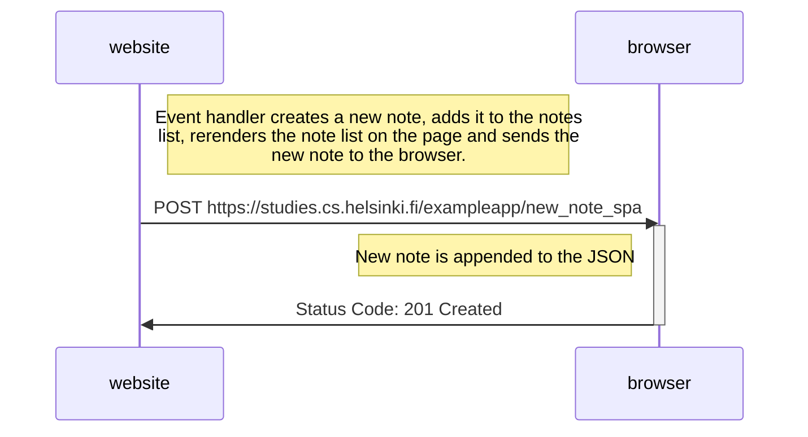

```mermaid
sequenceDiagram
    participant website
    participant browser

    Note right of website: Event handler creates a new note, adds it to the notes<br>list, rerenders the note list on the page and  sends the<br>new note to the browser.
    website ->> browser: POST https://studies.cs.helsinki.fi/exampleapp/new_note_spa
    activate browser
    Note left of browser: New note is appended to the JSON
    browser ->> website: Status Code: 201 Created
    deactivate browser
```